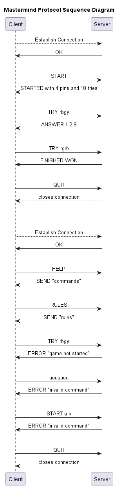

# DAI-PW2-Mastermind

Client/Server application to play games of Mastermind

## How to build the project

If you are using IntelliJ, there is a run configuration already set up for you. You can just run it.
Otherwise, you can use the following commands:

```bash
# Download the dependencies
./mvnw dependency:resolve

# Package the application
./mvnw package
```

## Basic Usage

### Server

```bash
# Run the server
java -jar target/DAI-PW2-Mastermind-1.0-SNAPSHOT.jar server
```

### Client

```bash
# Run the client
java -jar target/DAI-PW2-Mastermind-1.0-SNAPSHOT.jar client 
```

## PicoCLI usage

### Possible params with PicoCLI

#### Server

```
java -jar target/DAI-PW2-Mastermind-1.0-SNAPSHOT.jar server -h      
Usage: mastermind server [-hV] [-p=<port>] [-t=<nb_thread>]
  -h, --help        Show this help message and exit.
  -p=<port>         Port of the server (default: 4444)
  -t=<nb_thread>    Number of threads (default: 2)
  -V, --version     Print version information and exit.

```

#### Client 
```
Usage: mastermind client [-hV] [--host=<host>] [-p=<port>]
  -h, --help          Show this help message and exit.
      --host=<host>   Host (default: localhost)
  -p=<port>           Port (default: 4444)
  -V, --version       Print version information and exit.

```

### Server with custom port
```bash
# Run the server
java -jar target/DAI-PW2-Mastermind-1.0-SNAPSHOT.jar server -p 12345
```

### Client with custom port
```bash
# Run the client
java -jar target/DAI-PW2-Mastermind-1.0-SNAPSHOT.jar client -p 12345
```

## Examples of mastermind games

### Server side
```
java -jar target/DAI-PW2-Mastermind-1.0-SNAPSHOT.jar server   
Server is listening on port 4444
New client connected
Client disconnected.
```

### Client's side

```
java -jar target/DAI-PW2-Mastermind-1.0-SNAPSHOT.jar client   
Connected to server. Type 'START' to begin a game, 'RULES' for rules, 'HELP' for commands, 'QUIT' to quit.
Enter command: START
Do you want to play a default[1] (10 tries & 4 pins) or custom[2] game?
1
STARTED with 4 pins and 10 tries.
Enter command: TRY RGBY
Number of colors correctly placed: 0
Numbers of colors present in the answer: 3
Number of tries left: 9
Enter command: QUIT
Game Over, you lost. Type 'START' to play again or 'QUIT' to exit.
FINISHED LOST
```

## Definition of the protocol

### Section 1 - overview

The mastermind protocol is meant to play a game of mastermind versus a server over the network. The mastermind protocol 
is a client-server protocol. The client connects to a server to start a game of mastermind, the server then sends a 
message containing the starting point of the game. The client then tries to find the solution and sends it to the servers, 
which answers either with a message signifying the win of the client or with a clue for the answer. This goes on until the 
client found the answer, has no more tries left or request the game to stop or restart.

### Section 2 - Transport protocol

The mastermind protocol uses the TCP protocol. The server runs on port 44444.
The client has to know the IP address of the server to connect to it. It establishes the connection with the server.
The server closes the connection when the game is finished or if it is requested by the client.

### Section 3 - Messages

The client can send the following messages:

- `START` : used to start or restart a default game
- `START <nbTries> <nbPins>` : used to start or restart custom game
  - `<nbTries>` : the number of tries the client has to find the solution. Has to be an integer > 0
  - `<nbPins>` : the number of pins in the solution. Has to be an integer > 0
- `RULES`: used to get the rules of the game
- `HELP`: used to get the accepted requests from the server
- `TRY <proposition>` : used to propose an answer
	- `<proposition>`: the solution that the client wants to try, as a string of `nbPins` chars accepting only certain symbols
- `QUIT`: requests the server to close the connection

The server can send the following messages:
- `OK`: used to notify the client that the connection was successful and the server is ready to receive commands
- `STARTED <message>` : used to notify the client that the server will now accept TRY requests
  - `<message>` : the message to send to the client containing the number of tries and the number of pins 
- `SEND <content>`: sends the rules or the accepted commands from the server
  - `<content>` : the content of the message
- `ANSWER <clue1> <clue2> <triesLeft>` : used to send the answer with clues to a try back to the client
	- `<clues1>` : the number of pins that are in the right place and have the right color
    - `<clues2>` : the number of pins that have the right color but are not in the right place (the number of pins in the right place is not included in this number)
    - `<triesLeft>` : the number of tries left
- `FINISHED <status>` : used to answer the client when he has won the game or has no more tries
	- `<status>` can either be WON or LOST
- `ERROR <message>` : used to notify the client that an error occurred
  - `<message>` : the error message

### Section 4 examples

